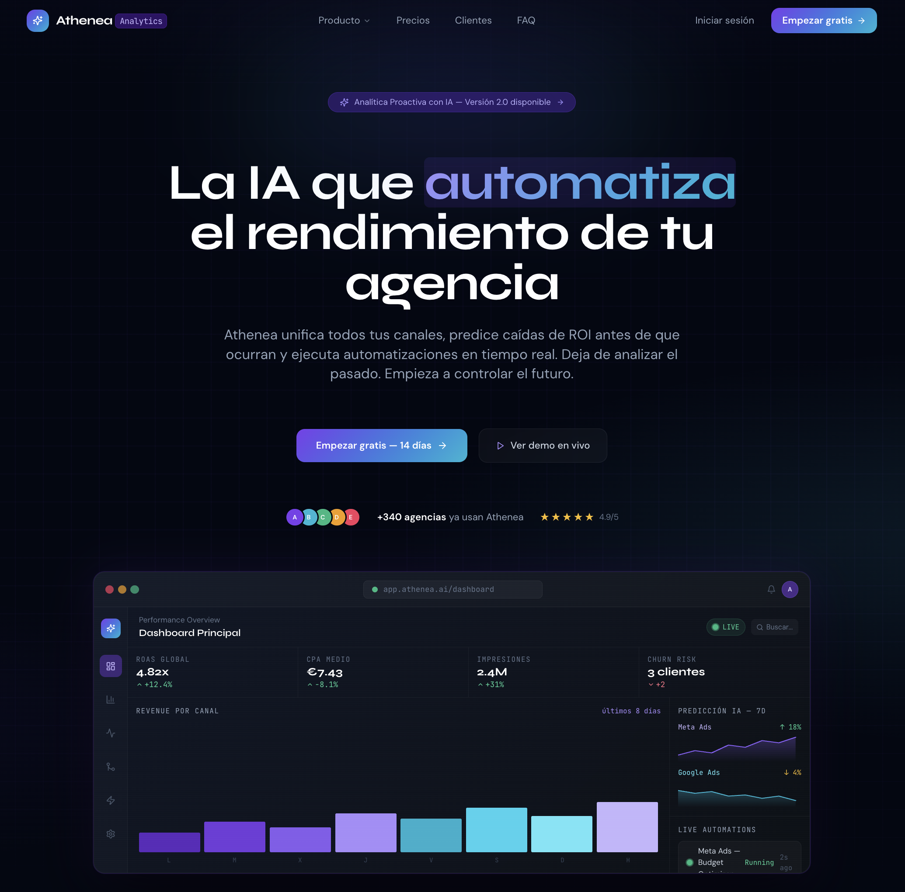

# 🌌 Athenea Analytics - AI SaaS Landing Page

  
  
  

    <strong>SaaS de analíticas con IA para agencias digitales con estética Cyberpunk Premium.</strong>
  

---

## 🛠 Stack Tecnológico
* **React 19 + Vite:** Rendimiento de última generación y empaquetado optimizado.
* **Tailwind CSS (v3.4):** Diseño "Dark Mode" con Obsidian Black (#030712) y acentos Electric Violet.
* **Framer Motion:** Micro-animaciones dinámicas e interacciones fluidas.
* **Lucide React:** Iconografía limpia y consistente.

## ✨ Características de Diseño
* **Glassmorphism:** Tarjetas con efectos de cristal y bordes interiores (inner-glow).
* **Mesh Gradients:** Fondos con mallas radiales y efectos visuales avanzados.
* **Typography:** Mezcla de *Syne* para impacto visual y *JetBrains Mono* para métricas.
* **Animaciones:** Efectos de escaneo (scan-line), pulsos live y barras dinámicas.

## 🚀 Instalación rápida
1. `npm install`
2. `npm run dev`

# 🌌 Athenea Analytics - AI SaaS Landing Page

  
  

  

    <strong>SaaS de analíticas con IA para agencias digitales con estética Cyberpunk Premium.</strong>
  

---
Creado por [Maria Gabriela Moran Paez](https://github.com/mariamoranpaez)
